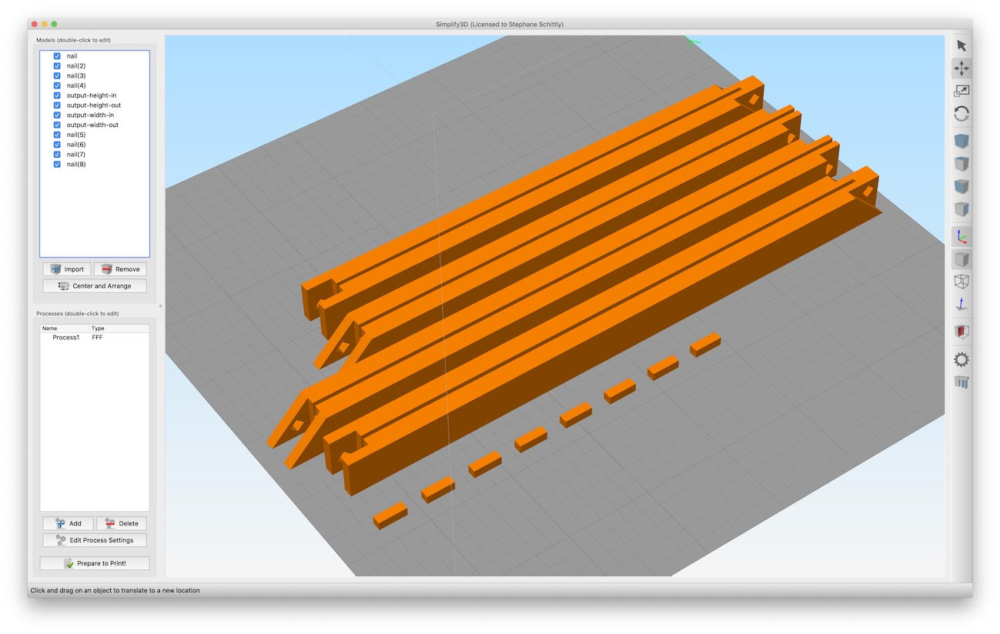

Customizable Picture Frame
===

A weekend project. Uses PHP to generate a custom picture frame ready to be 3D printed.

How to use
---
- Use http://lab.st-f.net/picframe/ to generate a frame online (recommended)
- See more pictures on the Thingiverse page: https://www.thingiverse.com/thing:3549400
- Use resizeObjLocal.php in command line using ```php resizeObjLocal.php 10 15``` to generate a 10x15cm frame (WIP - only generates single parts)

Export from blender
---
- Models should be exported from Blender as OBJ files with -X forward and Z up so they're correctly rotated in Simplify3D.
- Remember to flatten models before exporting!
- Selection only / Apply modifiers / Write normals / Triangulate faces





