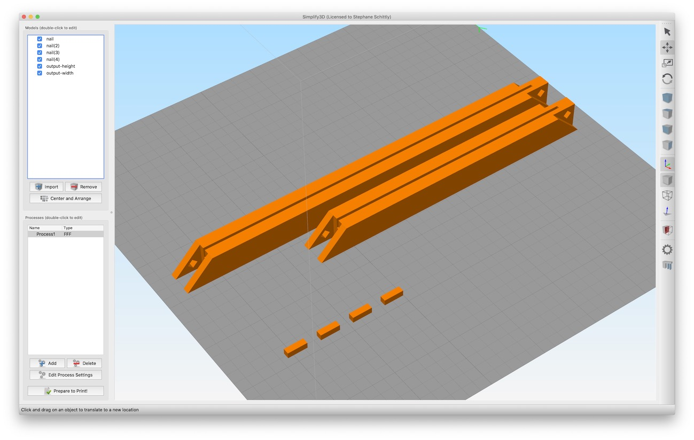

Customizable Picture Frame
===

A weekend project. Uses PHP to create a custom picture frame ready to be 3D printed.

How to use
---
- Use http://lab.st-f.net/picframe/ to generate a frame online (recommended)
- Use resizeObjLocal.php in command line using ```php resizeObjLocal.php 10 15``` to generate a 10x15cm frame

Export from blender
---
- Models should be exported from Blender as OBJ files 
        - with -X forward and Z up so they're correctly rotated in Simplify3D.
        (or with blender default: -Z forward Y up???)
- Remember to flatten models before exporting!
- Selection only / Apply modifiers / Write normals / Triangulate faces


Development status
---
- model-2cm.blend is not yet ready for custom resizing, only model-1cm is.


